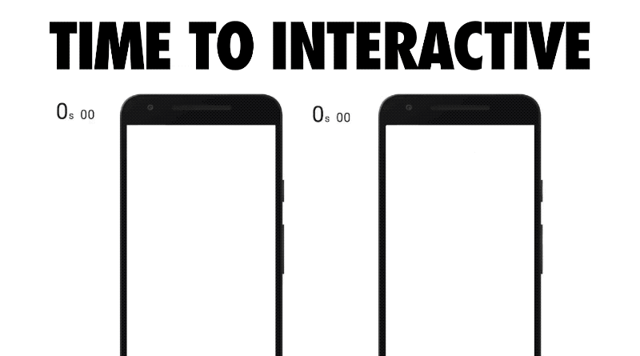

# Idle Until Urgent

The concept is simple; your code is initially deferred to idle periods, but then run immediately as soon as it’s needed. In other words: idle-until-urgent.

There's a fantastic [blog post](https://philipwalton.com/articles/idle-until-urgent/) by Phillip Walton on the concept, as well as some great code examples, but this guide will cover how to use the [idlize](https://github.com/GoogleChromeLabs/idlize) package by GoogleChromeLabs in the concept of a typical JS setup.

[ The cost of JavaScript in 2018 by Addy Osmani is another great read for JavaScript performance tips](https://medium.com/@addyosmani/the-cost-of-javascript-in-2018-7d8950fbb5d4)

## IdleValue

Idle value is for setting single values, where the cost to do so is expensive.

```js
import { IdleValue } from 'idlize/IdleValue.mjs'

const example = new IdleValue(() => {
  // Expensive code here
  return 1 + 1
})
```

Then, if we try and use our `example` variable later on, and we haven't yet evaluated it, it will be immediately called.

```js
const newValue = example * 2 // 4
```

## IdleQueue

The idle queue is useful for apps that want to split up their logic into a sequence of functions and schedule them to run idly.

It works similarly to [`requestIdleCallback()`](https://developer.mozilla.org/en-US/docs/Web/API/Window/requestIdleCallback), and in-fact uses that API, but does a few extra things:

- The queue can be configured so all queued functions are guaranteed to run before the page is unloaded.
- Queued tasks can be run immediately at any time.
- Queued tasks can pass a minimum time budget, below which they won't attempt to run (this minimum time budget can also be configured per queue).
- Queued tasks store the time/visibilityState when they were added to the queue, and are invoked with this data when run.

```js
import { IdleQueue } from 'idlize/IdleQueue.mjs'

const queue = new IdleQueue()

queue.pushTask(() => {
  // Some expensive function that can run idly...
})

queue.pushTask(() => {
  // Some other task that depends on the above
  // expensive function having already run...
})
```

## Using with Webpack chunks

Loading chunks of Javascript on demand seems like an impossible, time consuming, and stress-inducing task; yet that is not the case. You can import webpack chunks inside an `IdleQueue`, and then push tasks which require that package to the same queue, ensuring the chunk has been loaded before running the code. This could be fired by anything, maybe a button press, or the users scroll position.

:::warning
Be sure to update your webpack rules to use `.mjs` files, otherwise you will encounter issues.
:::

### Example (flickity)

A package like flickity works great for this sort of thing, as you can defer the large package until it's actually needed.

```js
import { IdleQueue } from 'idlize/IdleQueue.mjs'

const carouselQueue = new IdleQueue()
const openCarouselBtn = document.querySelector('.js-open-carousel')

carouselQueue.pushTask(() => {
  import(/* webpackChunkName: 'flickity' */ 'flickity').then(Flickity => {
    let flkty = new Flickity()
  })
})

openCarouselBtn.addEventListener('click', e => {
  e.preventDefault()
  carouselQueue.pushTask(() => {
    // Some code to display the carousel
  })
})
```
